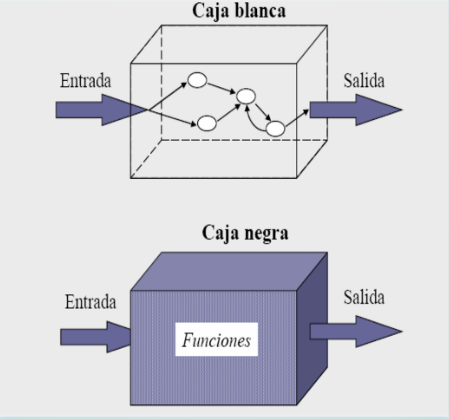

# **APUNTS UF 2.1**

## **PROVES**

### **FORMA DE LES PROVES**

#### PROVES DINÀMIQUES

Requereixen la execució de la aplicació. Permeten mesurar el comportament de l'aplicació desenvolupada.

#### PROVES ESTÀTIQUES

Es realitzen sense executar el codi de la aplicació. S'examina el codi font.

### **ESTRATÈGIES DE PROVA**

#### CAIXA NEGRA

S'estudia el sistema des de fora. Son proves de funcionalitat.

#### ESTRATÈGIES DE PROVA DE CAIXA NEGRA

- S'estudia el sistema des de fora.
- Es treballa sobre la interfície.
- No és tenen en compte els detalls interns de funcionament.
- Es proporciona entrades i s'estudia les sortides
- Principals tècniques:
  - Particions d'equivalència
  - Valors limit

#### **CAIXA BLANCA**

S'examina el codi font i la seva execució. Son proves estructurals.

#### ESTRATÈGIES DE PROVA DE CAIXA BLANCA

- S'examina el codi font i la seva execució-
- Es comproven els fluxos d'execució dintre de cada unitat (funció, classe, mòdul, etc.)
- També poden comprovar-se els fluxos entre unitats durant la integració.
- També es poden comprovar entre subsistemes, durant les proves de sistema.
- Principals tècniques:
  - Cobertura de codi
  - Prova de bucles

### **TIPUS DE PROVES**

#### FUNCIONALS

Avaluen el compliment dels requisits.

#### PROVES FUNCIONALS

- Proves unitàries (o d'unitat)
- Proves de regressió
- Proves d'integració
- Proves de fum (smoke test)
- Proves del sistema
- Proves alfa i beta
- Proves d'acceptació (validació per part del client)

#### **NO FUNCIONALS**

Avaluen aspectes addicionals com rendiment, seguretat, ...

#### PROVES NO FUNCIONALS

- Proves d'usabilitat
- Proves de rendiment
- Proves d'estres
- Proves de seguretat
- Proves de comptabilitat
- Proves de portabilitat

### **MECANISMES DE PROVA**

#### MANUAL

Mediant proves realitzades per personal de l'empresa o extern.

#### AUTOMÀTIC

Mediant programari que executa el codi de forma automatitzada i compara els resultat obtinguts i els resultats esperats.

### **SUPORT DEL DEPURADOR**

- Punts de ruptura
- Execució pas a pas
- Anàlisis de variables

### **AUTOMATITZACIÓ DE PROVES**

- Frameworks de proves (xUnit)
- Assercions

### **FRAMEWORKS PER A PROVES**

- **Java:** JUnit, TestNG
- **C++:** CppUnit, Google Test
- **PHP:** PHPUnit
- **Javascript:** Mocha

### **CAS DE PROVA**

- Un cas de prova està compost de:
  - Una entrada coneguda --> Una sortida esperada
- Per exemple:
  -  suma (2, 3) --> 5

## **INTEGRACIÓ**

### **FORMES D'INTEGRACIÓ**

- Integració Big Bang
- Integració Descendent
- Integració Ascendent
- Integració Continua (CI)

### **SERVIDORS D'INTEGRACIÓ CONTINUA**

**CI:** Integració continua
**CD:** Entrega continua

- Jenkins
- Bamboo
- TravisCI
- CircleCI

### **COBERTURA DEL CODI**

- És una mesura que indica el percentatge de codi que ha sigut executat durant les proves.
- És aconsellable que sigui el més proper al 100%.
- Si es del 100% llavors s'ha executat tot el codi font durant les proves.
- Si es menor del 100% llavors existeix codi font que no s'ha executat durant les proves.
- És possible realitzar la cobertura tant des de el IDE com des de un servei web apropiat.

## **QUALITAT**

### **CONTROL DE QUALITAT**

Per aconseguir un mesurament de la qualitat d'un producte necessitem realitzar proves.

### **QUALITAT DEL PROCÈS/PRODUCTE (QA/QC)**

- **QA:** És un conjunt d'activitats per a garantir la qualitat en els processos mitjan els quals es desenvolupen els productes.

- **QC:** És un conjunt d'activitats per a garantir la qualitat dels processos. Les activitats es centren en identificar defectes en els productes reals produïts.

### **FACTORS DE QUALITAT**

- El model de qualitat de **McCall** defineix 11 factors de qualitat.
- Aquests factors s'agrupen en 3 àmbits:
  - Operació del producte
  - Revisió del producte
  - Transició del producte

#### OPERACIÓ DEL PRODUCTE

- Correcció
- Fiabilitat
- Eficiència
- Seguretat
- Facilitat d'ús

#### REVISIÓ DEL PRODUCTE

- Mantenibilitat
- Flexibilitat
- Facilitat de proves

#### TRANSICIÓ DEL PRODUCTE

- Portabilitat 
- Reusabilitat
- Interoperativitat
